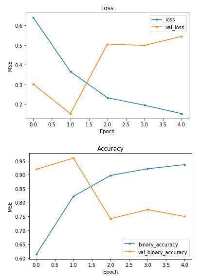
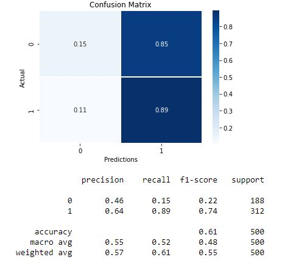
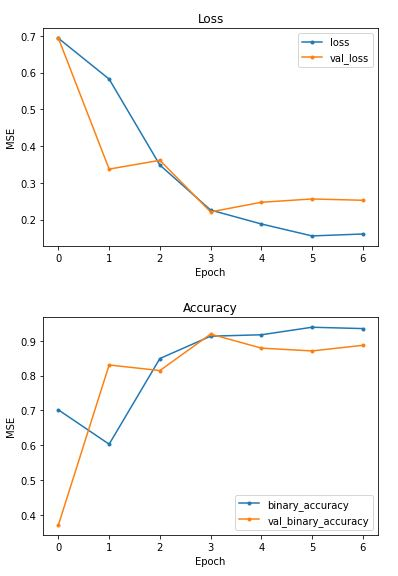
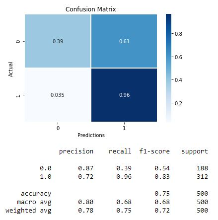
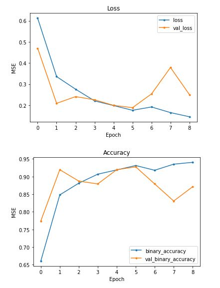
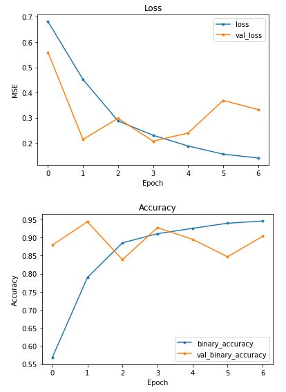
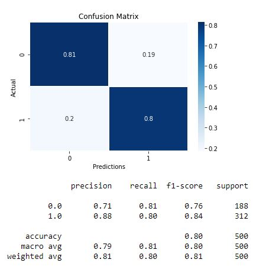

# Phase 4 Project: Computer Vision for Detecting Pneumonia in X-Ray Images
**Sam Lim**  
**James Irving**  
**First Presentation: 6/25/21**  

## Contents

 - <a href='#BusinessProblem'> Business Problem </a>
 - <a href='#Preprocessing'> Preprocessing </a>
 - <a href='#DataModeling'> Data Modeling</a>
 - <a href='#Recommendation'> Recommendation </a>
 - <a href='#Conclusion'> Conclusion </a>

 

## Business Problem

Due to a shortage of staff and doctors through COVID-19, the St.Jude Children's Hospital wants to use A.I. to diagnose pneumonia through x-ray images of children's lungs. The goal of this project is to use convolution neural network for computer vision to detect pneumonia from x-ray images.

## Preprocessing
In order for the neural network to be able to read and understand images, I used the ImageDataGenerator from tensorflow.keras. Each pixel's RGB value was divided by 255 so that they ranged from 0 to 1. Also, because the provided validation set was too small, I had to split the test set to create a new validation set. 
 
The image on the left shows a normal chest x-ray and the right shows pneumonia chest x-ray 

    
    

## Data Modeling
Using Convolutional Neural Network(CNN), I initially created 10 convolutional layers, 5 maxpooling layers, and 3 dense layers. All iterations used adam as the optimizer, binary crossentropy as the loss function and binary accuracy as the main metric. Each iteration had two versions; the first version used the validation loss as the stopping metric and the other used validation accuracy as the stopping metric. Overall, using validation accuracy as the stopping metric created better models. The goal for each proceeding iteration was to reduce the number of overall layers while increasing/maintaining the overall accuracy of the model.  
The first set of images is the first iteration of the model that used validation loss as the stopping metric, and the second set is the same model using validation accuracy as the stopping metric. The graph clearly indicates that using the validation accuracy helped the overall fitness of the model. 

    
    

 

    
    

 
The next two sets of the images are the third iteration of the model. The first set uses validation loss and the secon duses validation accuracy as the stopping metric.

    
    

 

    
    

 
There was a total of four iteration of the modeling process, but reducing the number of convolutional layers after a certain point impaired the overall model.

## Recommendation 
As can be observed from the above 

## Conclusion 