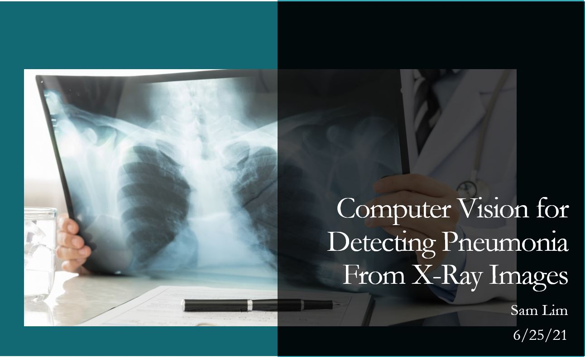
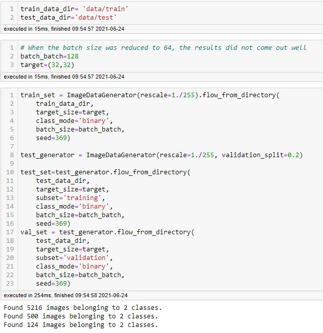
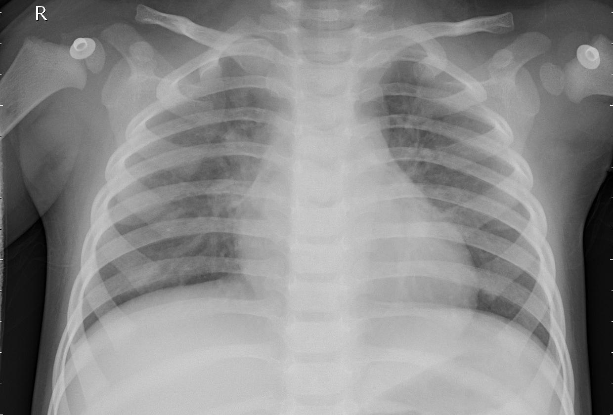

# Phase 4 Project: Computer Vision for Detecting Pneumonia in X-Ray Images
**Sam Lim**  
**James Irving**  
**First Presentation: 6/25/21**  

## Contents

 - <a href='#BusinessProblem'> Business Problem </a>
 - <a href='#Preprocessing'> Preprocessing </a>
 - <a href='#DataModeling'> Data Modeling</a>
 - <a href='#Recommendation'> Recommendation </a>
 - <a href='#Conclusion'> Conclusion </a>

 

## Business Problem

Due to a shortage of staff and doctors through COVID-19, the St.Jude Children's Hospital wants to use A.I. to diagnose pneumonia through x-ray images of children's lungs. The goal of this project is to use convolution neural network for computer vision to detect pneumonia from x-ray images.

## Preprocessing
In order for the neural network to be able to read and understand images, I used the ImageDataGenerator from tensorflow.keras. Each pixel's RGB value was divided by 255 so that they ranged from 0 to 1. Also, because the provided validation set was too small, I had to split the test set to create a new validation set. 

The image on the left shows a normal chest x-ray and the right shows pneumonia chest x-ray

## Data Modeling

## Recommendation 

## Conclusion 