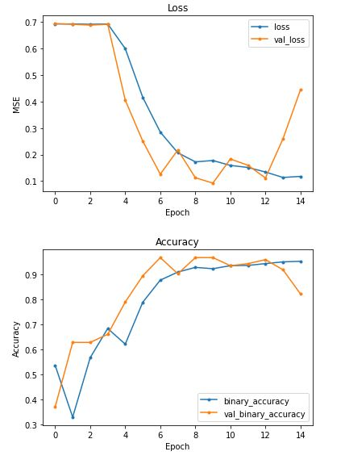
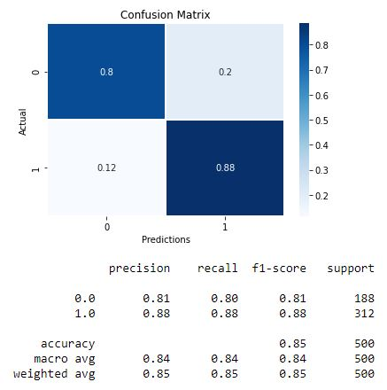
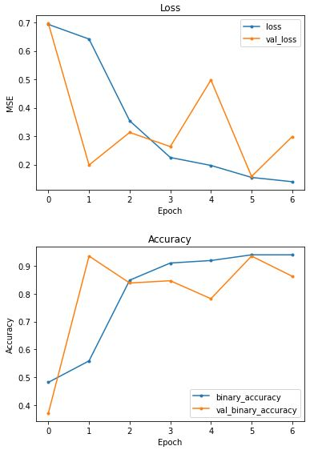
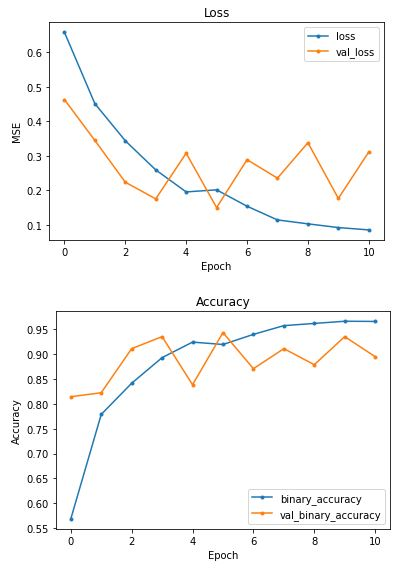
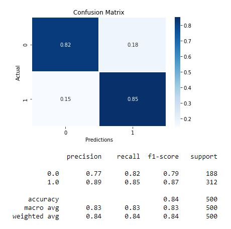
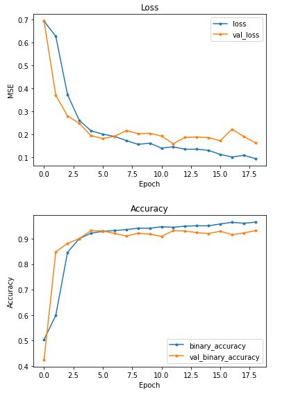
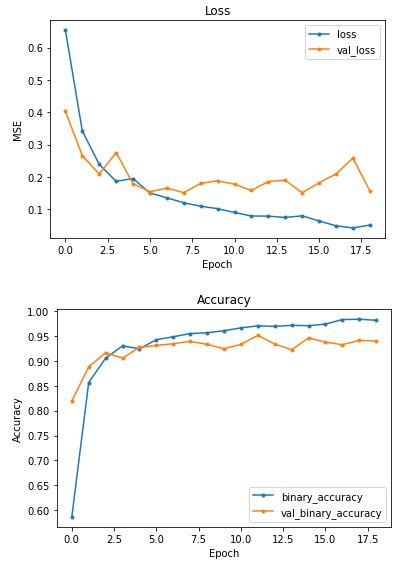

# Phase 4 Project: Computer Vision for Detecting Pneumonia in X-Ray Images
**Sam Lim**  
**James Irving**  
**First Presentation: 6/25/21**  

## Contents

 - <a href='#BusinessProblem'> Business Problem </a>
 - <a href='#Preprocessing'> Preprocessing </a>
 - <a href='#DataModeling'> Data Modeling</a>
 - <a href='#OverSampling'> Oversampling </a>
 - <a href='#Recommendation'> Recommendation </a>
 - <a href='#Conclusion'> Conclusion </a>

 

## Business Problem

Due to a shortage of staff and doctors through COVID-19, the St.Jude Children's Hospital wants to use A.I. to diagnose pneumonia through x-ray images of children's lungs. The goal of this project is to use convolution neural network for computer vision to detect pneumonia from x-ray images.

## Preprocessing
In order for the neural network to be able to read and understand images, I used the ImageDataGenerator from tensorflow.keras. Each pixel's RGB value was divided by 255 so that they ranged from 0 to 1. Also, because the provided validation set was too small, I had to split the test set to create a new validation set. 
 
Currently, there is an imbalance between the number of normal images and pneumonia images, so each category of images will be given a weight to counter act the imbalance.  
 
The image on the left shows a normal chest x-ray and the right shows pneumonia chest x-ray 

    
    

Such images above are then downsized to 64 x 64 pixel images 

## Data Modeling
Using Convolutional Neural Network(CNN), I initially created 10 convolutional layers, 5 maxpooling layers, and 3 dense layers. All iterations used adam as the optimizer, binary crossentropy as the loss function and binary accuracy as the main metric. Each iteration had two versions; the first version used the validation loss as the stopping metric and the other used validation accuracy as the stopping metric. Overall, using validation accuracy as the stopping metric created better models. The goal for each proceeding iteration was to reduce the number of overall layers while increasing/maintaining the overall accuracy of the model.  
The first set of images is the first iteration of the model that used validation loss as the stopping metric, and the second set is the same model using validation accuracy as the stopping metric. The graph clearly indicates that using the validation accuracy helped the overall fitness of the model. 
#### Model 1. Stopping metric = validation loss

    
    

 
#### Model 1. Stopping metric = validation accuracy

    
    

 
The next two sets of the images are the third iteration of the model. The first set uses validation loss and the second uses validation accuracy as the stopping metric.
#### Model 3. Stopping metric = validation loss

    
    

 
#### Model 3. Stopping metric = validation accuracy

    
    

 
There was a total of four iteration of the modeling process, but reducing the number of convolutional layers after a certain point impaired the overall model.

## Oversampling
As mentioned before, there is a large difference between the number of normal images and pneumonia images in the training data set. While we tried to mitigate this problem by assigning each category different weights, the results could still be improved. Oversampling is a technique that is highly recommended when there is a large imbalance between the binary data. I created another folder that contained two copies of normal images from the training set and 1 copy of normal images from the testing set.  
[osimg](images/OSnumberofimages.JPG) 
Compared to the previous training dataset, the oversampled dataset has a much balanced proportion of normal to pneumonia images. With the oversampled dataset, I trained the same models above and was able to achieve much better results.  

#### Oversampled Model 1. Stopping metric = validation loss

    
    

 
#### Oversampled Model 2. Stopping metric = validation accuracy

    
    

 

#### Oversampled Model 3. Stopping metric = validation loss

    
    

 

#### Oversampled Model 4. Stopping metric = validation accuracy

    
    

 
Not all of the iterations are displayed in this README, but they are available in the main .ipynb page. 

## Recommendation 
Overall, I would recommend using the 4th iteration of the model from the oversampled dataset that uses validation accuracy as its stopping metric. This version of the iteration was able to achieve 88% recall score for true negatives and 98% for true positives. This model is not to be used as a be it end all method of diagnosing pneumonia in patients; however, but should be used to facilitate a doctor's diagnosis. 
For example, if the modeling diagnosed a patient to be suffering from pneumonia, but in reality did not suffer from it, the patient will have to go through unnecessary treatment that will increase hospital bills as well as create medical complications as he or she could have been suffering from a different disease. As mentioned before, this model will be able to diagnose 98% of pneumonia patients as pneumonia patients, but 12% of normal patients could be diagnosed as pneumonia patients, so it is advised that doctors double check the patients' x-ray images if the model's result comes back as pneumonia. 

## Conclusion 

### Future Work
For future work, I would like to improve the model's prediction on false positives. While it was very apt in diagnosing pneumonia for patients with pneumonia, it was as much likely to diagnose pneumonia to those who did not have the disease. Possible solutions may be:
 - Format/align the pictures to show just the thorax region to remove possible mis-detections
 - Distinguish sections such as the heart to remove possible mis-detections
 - Separate images of bacterial pneumonia and viral pneumonia for training for ease of diagnosis since they require different treatments. 

### Final Thoughts
Overall, the project was as challenging as it was insightful. After visiting an A.I. expo and seeing how computer vision was being used to diagnose cancer and how the A.I. that they had created were finding previously unknown indications that could lead to an early diagnosis of breast cancer. The year before this, the doctors had found a tumor-like tissue in her uterus during an annual check up. Fortunately it turned out to be a benign form, but we were worried that she could develop breast cancer as uterine tumors could lead to or were early signs of breast cancer. Because of this previous incident, the use of A.I. in diagnosing cancer spoke to me in a different way, and I became much interested in general A.I. and the use of A.I. in the medical field. Though this project is miles behind compared to what I had seen in the expo, it was meaningful nonetheless.

